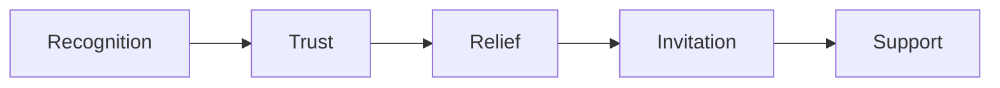

## New Structure: 8-Section Feminine Flow

Following the [Feminine Landing Page Flow.md](Feminine%20Landing%20Page%20Flow.md) blueprint:

### Section 1: Hero (Recognition Without Pressure)

**Replace** current hero entirely.

- **Headline:** "Turning ideas into working reality - without the technical weight."
- **Subline:** "For entrepreneurs who are done chasing tools and just want things to work."
- **Tagline:** "Calm systems. Clear direction. Quiet support."
- **CTA:** Single soft scroll invitation ("See if this fits you")

### Section 2: Recognition / Mirror (NEW)

**Add** below hero - this section is currently missing.

Title: "If this feels familiar"

Short paragraphs that name the frustration without blaming:

- Ideas feel heavier to bring to life than they should
- Tools and options pull away from actual work
- Tired of figuring everything out alone

Anchor: "Having ideas isn't the hard part. Carrying them all by yourself is."

### Section 3: Safety & Trust - How I Work

**Replace** the current About section.

Title: "How I work"

Grounded bullets:

- We move slowly and intentionally
- We don't overcomplicate
- We build only what actually supports you
- Your time and energy come first

Anchor: "You don't need to learn more tools. You need systems that work for you."

Remove: Stats (3+ years, 15+ projects, 20+ clients) - too metric-focused for this approach.

### Section 4: After-State / Relief (NEW)

**Add** after "How I work" section.

Title: "What this creates"

Two-column before/after transformation:

| Before | After |

|--------|-------|

| Information scattered across tools | Information comes to you |

| Constant mental noise | Clarity replaces noise |

| Half-built ideas | Ideas land into structure |

| The feeling of "almost there" | Systems run quietly in the background |

Closing: "Not more output. More ease, confidence, and clarity."

### Section 5: Translation Layer - Skills Reframed

**Replace** current Skills section with outcome-focused framing.

Title: "What this looks like in practice"

Intro: "Depending on your situation, this support can take different forms."

Reframed skills:

- **Data extraction** - Information comes to you instead of you chasing it
- **Data analysis** - Mental noise replaced by clarity and insight
- **Website optimization** - Your work feels light, smooth, and trustworthy
- **AI support** - Intelligent systems that reduce tasks, not add them

Key line: "You don't need to know what you need upfront. We figure that out together."

### Section 6: Social Proof (Reframed)

**Keep** testimonials, **change** framing.

New title: "What clients often say after working together"

Add intro: "Not about speed or hacks - but about clarity, support, and trust."

Keep existing testimonials and recommendations (they already emphasize qualities like "easy to communicate," "thinks with you," "support").

Move Projects **below** testimonials with intro: "A few examples of how ideas were translated into working systems."

### Section 7: Pre-Contact Threshold (NEW)

**Add** before contact form.

Title: "If you're curious about what your idea needs next"

Soft invitation: "Share where things feel heavy or unclear - no plan needed."

Button: "Share your idea"

### Section 8: Contact as Choice

**Replace** current contact section language.

Closing: "When you're ready to stop carrying the technical weight alone, I'm here."

Soft CTAs: "Start a conversation" / "Schedule a call"

No urgency messaging.

---

## Meta Updates

Update page title and meta description to match new positioning:

- **Title:** "Laura Otto | Systems that support your vision"
- **Description:** "I help vision-led entrepreneurs move from ideas into working reality - without the technical weight, confusion, or friction."

---

## Additional Deliverable

Create `sales-input-summary.md` in the project root containing the user's input notes organized by:

- Core positioning and philosophy
- Audience definition
- Technical skills reframed
- Key phrases and copy
- Emotional outcomes
- Sales flow principles

---

## What We Are NOT Adding

- Buzzwords or spiritual fluff
- Long metaphors
- Overly emotional language
- Urgency or scarcity tactics

We are simply: reordering trust, naming relief, respecting timing.